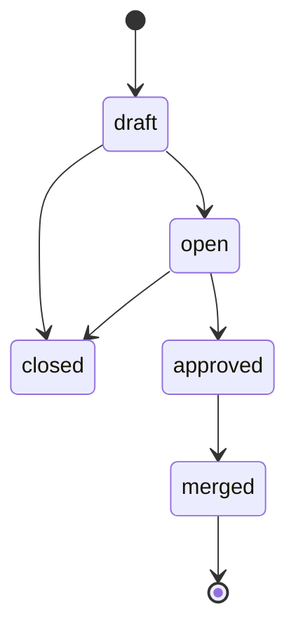

# Mermaid Diagrams in GitHub READMEs

GitHub renders Mermaid diagrams natively in markdown files. Just use a fenced code block with `mermaid` as the language.

```markdown

```

Works in READMEs, issues, PRs, and wikis. Also supported by GitLab, Notion, Obsidian, and VS Code (with extension).

For state machines, `stateDiagram-v2` is clean. For flows, use `flowchart LR` (left-right) or `flowchart TD` (top-down).

No external tools needed. The diagram lives in your markdown, version-controlled with your code.

#github
